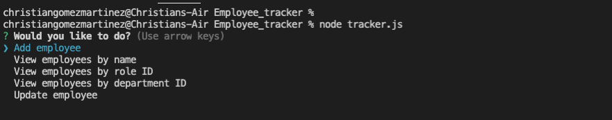
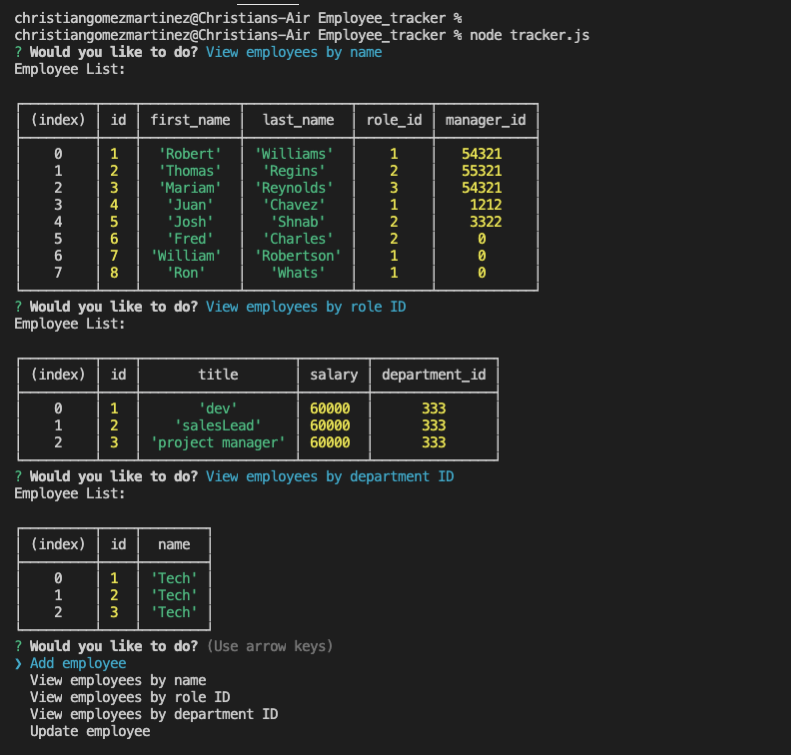
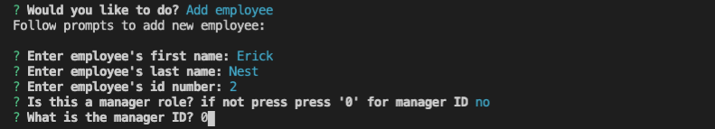
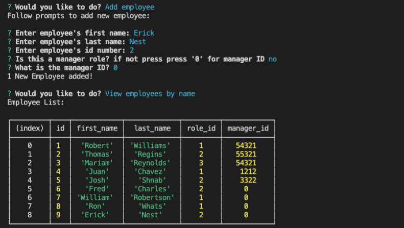
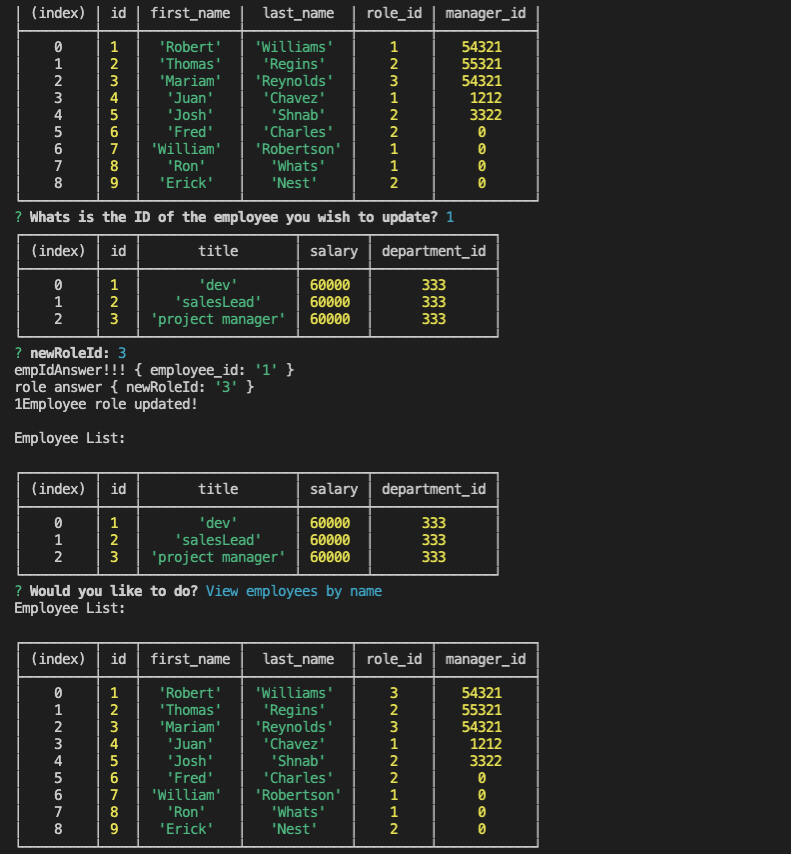

# Employee_tracker

Within this application, users can view a list of all the employees within a compnay with their first name, last name, role id and also manager id if he/she are a manager. There is also a table that displays the employee id along eith the title and their salary with a department id and also a roles table.

## Usage

using the app is simple. After running the comand line, the user will be prompted to select what they would like to do suck as view all employees by name, view roles or departments by id. One can also add an employee and update an employees rolo by using their id.

[GitHub](http://github.com)

